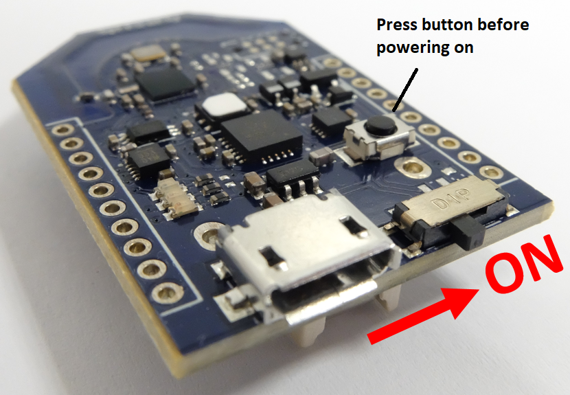
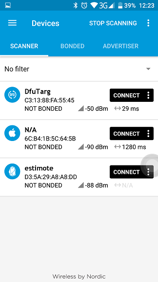
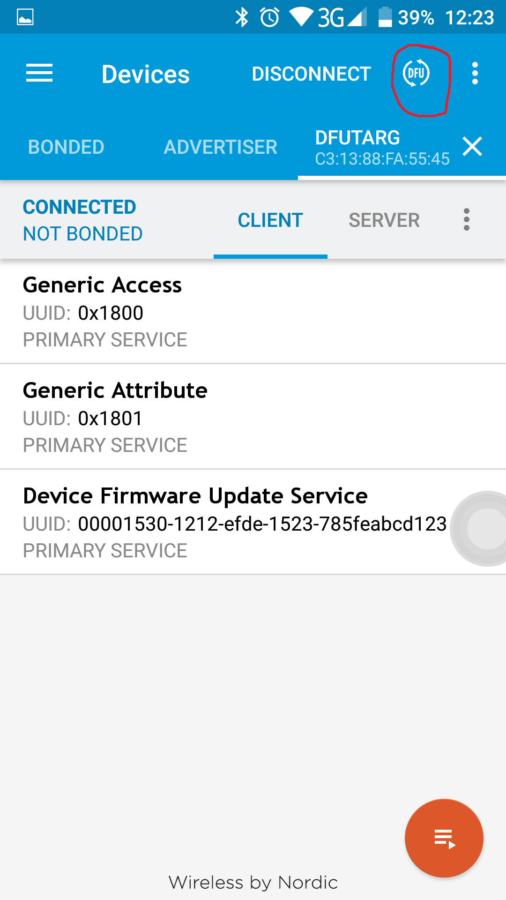
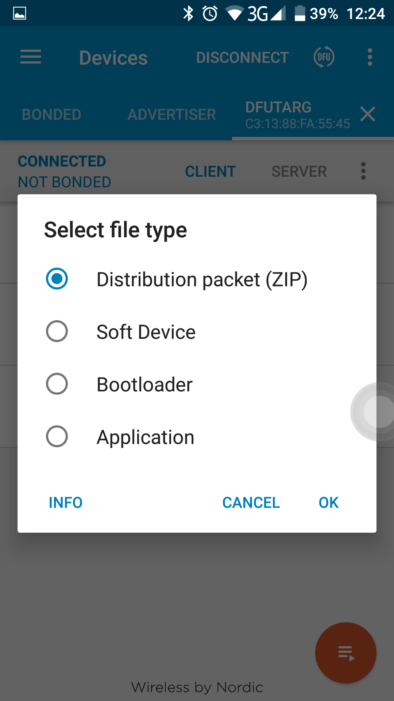
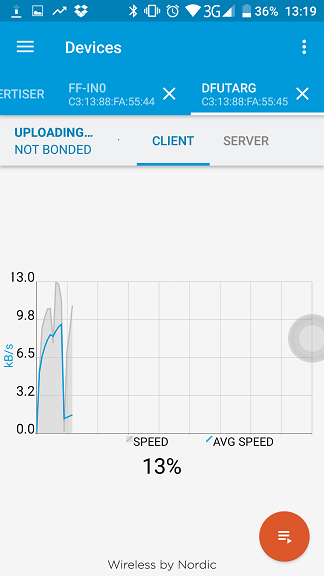

# Abstract

## FlyTag-Firmware

Repository of FlyTag Firmware

Firmware:

* [FlyTag_v1.0.13.zip](FlyTag_v1.0.13.zip)

  Firmware that supports all recipes for IoT projects.
  functions:
	* allows connection to FlyTag,
	* can be sent commands and responds to them.

* [FlyTag_v1.1S.zip](FlyTag_v1.1S.zip)

  Firmware that supports all recipes for IoT projects,
  with added feature of having a possibility of driving a servo motor.
  functions:
	* allows connection to FlyTag,
	* can be sent commands and responds to them,
	* additional command for driving servo motor

## Firmware upgrade

In order to reprogram your FF1502 you have to start the FF1502 in bootloader mode which is done by pressing the button before powering up the device:

Another thing you need is a mobile app `nRF Connect for Mobile` which is obtainable for ios and android. With nrf connect you connect to your FF1502 in bootloader mode (DfuTarg):

Then press the button DFU as in the picture:

Select distribution packet and select the firmware you want:

The process of reprogramming starts automatically:

